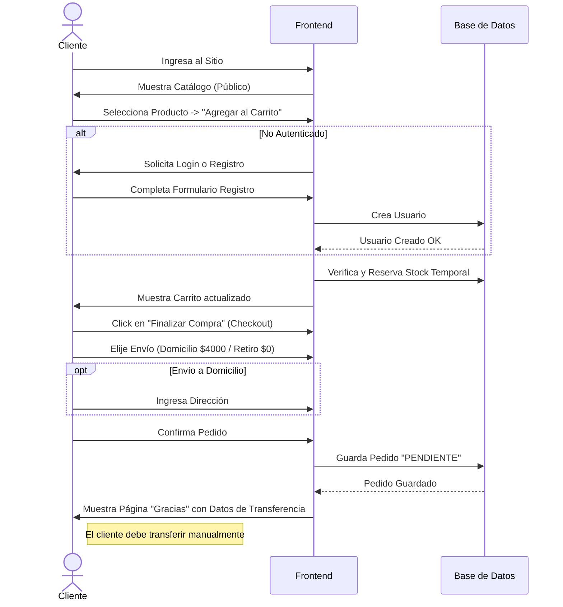
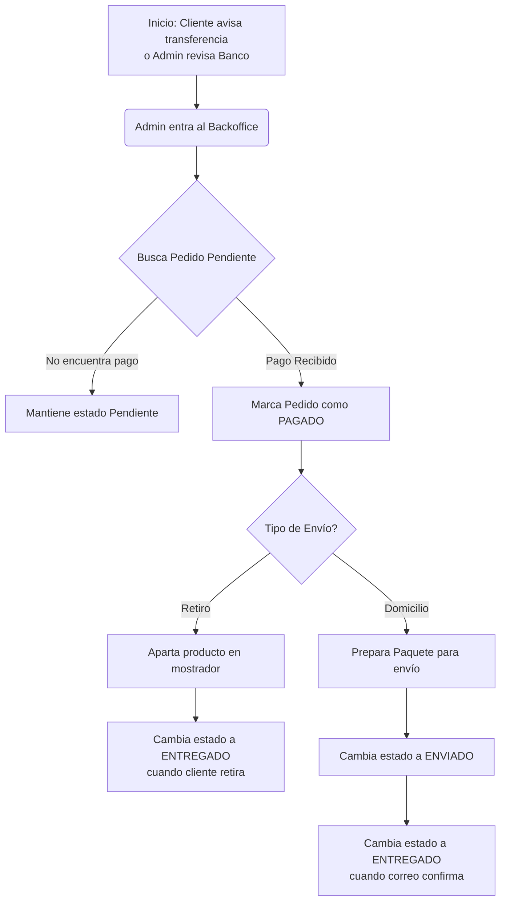

# 06. Flujos de Usuario (User Flows)

## Flujo 1: Registro y Compra (Cliente)
Este flujo describe el camino feliz de un cliente nuevo que llega, se registra, agrega productos y completa la compra.

## Flujo 2: Verificación y Despacho (Administrador)
Flujo donde el administrador revisa un pago y procesa el pedido.

